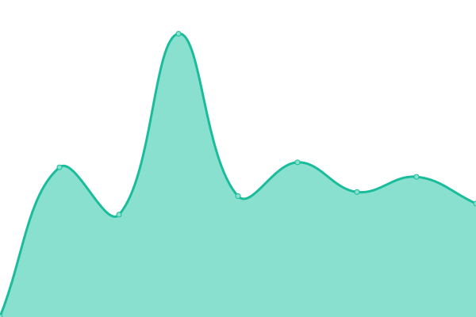
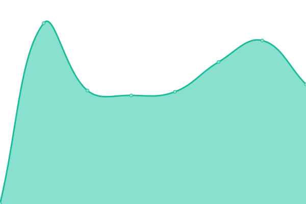

# [📈 Live Status](https://monitor.optbp.com): <!--live status--> **🟩 All systems operational**

This repository contains the open-source uptime monitor and status page for [optbp-monitor](https://monitor.optbp.com), powered by [Upptime](https://github.com/upptime/upptime).

With [Upptime](https://upptime.js.org), you can get your own unlimited and free uptime monitor and status page, powered entirely by a GitHub repository. We use [Issues](https://github.com/optbp-monitor/optbp-monitor/issues) as incident reports, [Actions](https://github.com/optbp-monitor/optbp-monitor/actions) as uptime monitors, and [Pages](https://monitor.optbp.com) for the status page.

<!--start: status pages-->
<!-- This summary is generated by Upptime (https://github.com/upptime/upptime) -->
<!-- Do not edit this manually, your changes will be overwritten -->
<!-- prettier-ignore -->
| URL | Status | History | Response Time | Uptime |
| --- | ------ | ------- | ------------- | ------ |
|  [Patient UI](https://pt.optbp.com/) | 🟩 Up | [patient-ui.yml](https://github.com/optbp-monitor/optbp-monitor/commits/HEAD/history/patient-ui.yml) | 

 430ms
     
 | 

<a href="https://monitor.optbp.com/history/patient-ui">100.00%</a>
    

|  [Clinician UI](https://clin.optbp.com/) | 🟩 Up | [clinician-ui.yml](https://github.com/optbp-monitor/optbp-monitor/commits/HEAD/history/clinician-ui.yml) | 

 416ms
     
 | 

<a href="https://monitor.optbp.com/history/clinician-ui">100.00%</a>
    

|  [Auth Server](https://auth.optbp.com/Account/LoginWithPasscode) | 🟩 Up | [auth-server.yml](https://github.com/optbp-monitor/optbp-monitor/commits/HEAD/history/auth-server.yml) | 

 424ms
     
 | 

<a href="https://monitor.optbp.com/history/auth-server">100.00%</a>
    

|  [API Server](https://api.optbp.com/api/practice/additionaldetails/) | 🟩 Up | [api-server.yml](https://github.com/optbp-monitor/optbp-monitor/commits/HEAD/history/api-server.yml) | 

 427ms
     
 | 

<a href="https://monitor.optbp.com/history/api-server">100.00%</a>
    

<!--end: status pages-->

[**Visit our status website →**](https://monitor.optbp.com)

## 📄 License

- Powered by: [Upptime](https://github.com/upptime/upptime)
- Code: [MIT](./LICENSE) © [optbp-monitor](https://monitor.optbp.com)
- Data in the `./history` directory: [Open Database License](https://opendatacommons.org/licenses/odbl/1-0/)
